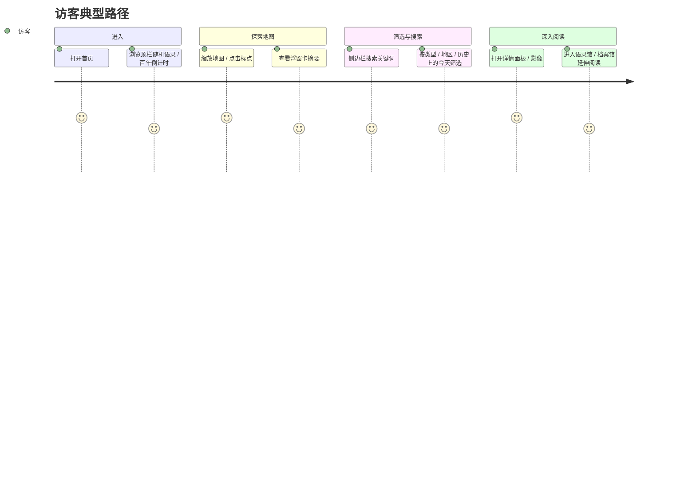
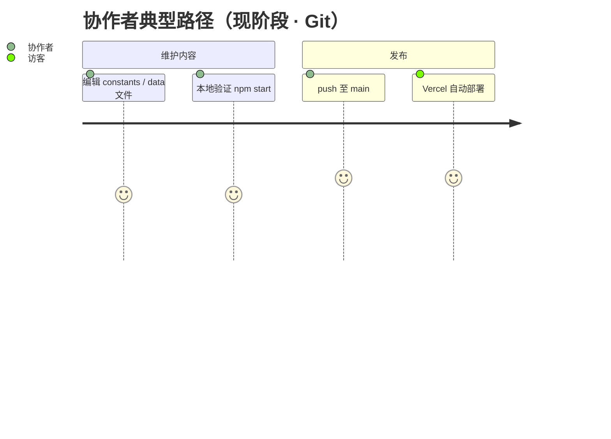
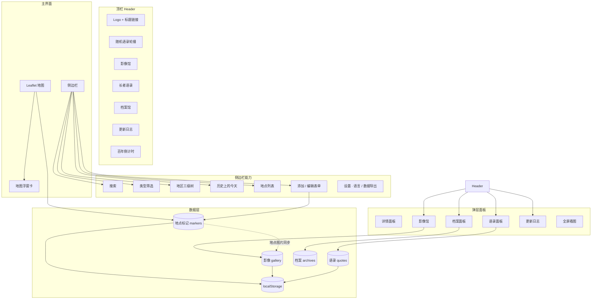
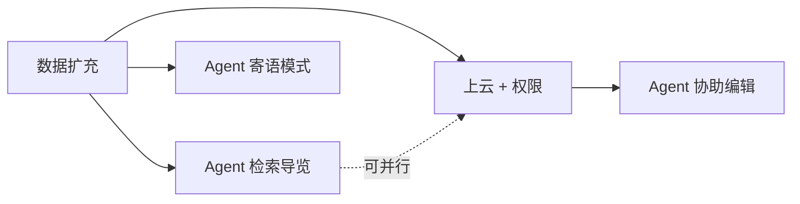

# 江泽民同志生平纪念地图 · 产品需求文档（PRD）

| 字段 | 内容 |
|------|------|
| **版本** | v0.2 |
| **状态** | Living Document（随产品迭代更新） |
| **最后更新** | 2026-06-03 |
| **仓库** | [BruzeLam/jzm-memorial-map](https://github.com/BruzeLam/jzm-memorial-map) |
| **默认分支** | `main` |
| **部署** | Vercel（push 自动部署） |
| **关联文档** | [NOTES.md](../NOTES.md)（迭代流水账）、[CLAUDE.md](../CLAUDE.md)（开发速查） |

---

## Executive Summary（一页摘要）

**江泽民同志生平纪念地图** 是一款以交互式地图为主线的纪念 / 教育向 Web 产品。它将生平**足迹、历史事件、题字地点**与**影像、语录、档案文献**串联在同一空间与时间维度上，帮助访客理解长者一生的地理轨迹与历史脉络。

- **产品性质**：非营利纪念项目；维护成本由维护者自担；可接受随缘打赏，**不以商业化为目标**。
- **技术栈**：React + Leaflet + Tailwind + OpenStreetMap 底图；国内地点搜索接 **高德 Web 服务**（GCJ-02 → WGS-84）；可选 **Supabase**（登录、云端数据、Storage、待审投稿）；部署于 Vercel。
- **当前阶段**：核心功能已上线；官方数据以 **Git 改代码 + push 部署** 为主；Supabase 上云能力已部分落地（见 [ADMIN_SETUP.md](./ADMIN_SETUP.md)），访客无账号时仍以 localStorage 体验为主。
- **近期方向**：扩充官方内容 → 完善上云与协作者权限 → 导览 Agent（只读起步）。
- **核心原则**：内容**可溯源、不编造**；功能**庄重简洁**；数据结构演进**向后兼容**。

---

## 1. 背景与问题

### 1.1 要解决的问题

江泽民同志的生平资料分散在地图坐标、新闻报道、讲话摘录、题字影像等多处。普通访客难以：

- 在**空间上**理解「何时、何地、发生了什么」；
- 在**时间上**按年代或「历史上的今天」浏览相关节点；
- 从单一地点**延伸到**语录、档案与图片。

### 1.2 产品定位

| 维度 | 定义 |
|------|------|
| **是什么** | 交互式生平纪念地图 + 影像馆 + 语录 + 档案馆 |
| **不是什么** | 公众自由编辑的 Wiki、社交媒体、商业化 SaaS |
| **受众** | 对长者生平与历史感兴趣的访客；少数内容协作者 |
| **调性** | 庄重、清晰、可溯源；避免娱乐化与戏谑化交互 |

### 1.3 成功标准（可验证）

| 指标 | 目标 |
|------|------|
| **发现效率** | 访客在 3 次点击内从地图或列表到达目标地点详情 |
| **内容可信** | 每条标记尽量有来源；空缺字段留空，不臆造 |
| **维护效率** | 协作者可通过 Git（现阶段）或未来后台高效更新官方数据 |
| **性能** | 首屏与地图交互流畅；图片经压缩后体积可控 |
| **成本** | 非商业前提下，托管与 AI 费用可长期自担 |

---

## 2. 用户与场景

### 2.1 用户角色

| 角色 | 描述 | 权限（目标态） | 权限（现阶段） |
|------|------|----------------|----------------|
| **访客** | 打开网站浏览地图与内容 | 只读 | 只读浏览；localStorage 本地改动仅影响本机 |
| **协作者** | 小团队成员，维护官方内容 | 登录后可编辑 | 通过 GitHub 协作改内置数据并部署 |
| **维护者** | 产品 Owner，负责方向与审核 | 全部权限 + 部署 | 同协作者 + Vercel/Git 管理 |

### 2.2 典型用户旅程





---

## 3. 信息架构

### 3.1 模块总览



### 3.2 页面布局

- **桌面端**：顶栏 + 左侧可收起侧边栏 + 右侧地图主区域；详情 / 弹层覆盖于地图之上。
- **响应式**：侧边栏可收起，地图始终占据主视觉区域。

---

## 4. 功能需求 · 当前已上线

以下功能均已实现并部署（详见 [NOTES.md 已完成列表](../NOTES.md)）。

### 4.1 地图与标记

| ID | 功能 | 优先级 | 验收标准 |
|----|------|--------|----------|
| M-01 | 三种标记类型 | P0 | 支持足迹 / 历史事件 / 题字，颜色与图标可区分 |
| M-02 | 地图标点展示 | P0 | 在 Leaflet 地图上正确渲染全部 filtered markers |
| M-03 | 标点缩放自适应 | P1 | zoom ≥ 8 保持 36/44px；全球视图适度缩小 |
| M-04 | 点击标点 | P0 | 选中标记；地图智能 flyTo（约 10–12 级）；展示浮窗卡 |
| M-05 | 浮窗卡 | P0 | 显示名称、日期、摘要；可进详情或「补充信息」 |
| M-06 | 关闭浮窗缩回 | P1 | 关闭浮窗时地图缩小 2 级（最低 7 级） |
| M-07 | 空白处地图点击 | P1 | 添加模式下可拾取坐标；表单开启时可更新经纬度 |
| M-08 | 同标签行程关联 | P2 | 相同 trip 标签的地点在详情中展示关联节点（TripSiblings） |

**标记类型定义：**

| type | 中文 | 用途 |
|------|------|------|
| `spot` | 足迹 | 出生地、工作地、访问地点 |
| `event` | 历史事件 | 重要历史节点 |
| `inscription` | 题字 | 书法题字地点 |

### 4.2 侧边栏 · 搜索与筛选

| ID | 功能 | 优先级 | 验收标准 |
|----|------|--------|----------|
| S-01 | 关键词搜索 | P0 | 匹配名称、标题、描述、地区路径、标签等 |
| S-02 | 类型筛选 | P0 | 可单独开关三种类型 |
| S-03 | 地区三级树 | P0 | 中国 / 海外分组；国 → 省 → 市多选；Fixed 定位不被遮挡 |
| S-04 | 历史上的今天 | P1 | 按当前月日筛选有日期的标记；无日期排最后 |
| S-05 | 地点列表 | P0 | 展示筛选结果；点击跳转地图选中 |
| S-06 | 统计信息 | P2 | 展示总数与各类型数量 |

### 4.3 地点 · 添加与编辑

| ID | 功能 | 优先级 | 验收标准 |
|----|------|--------|----------|
| A-01 | 添加模式选择 | P0 | 支持「地图标点」与「手动输入坐标」 |
| A-02 | 完整表单字段 | P0 | 类型、名称、坐标、行政区划、日期（可选）、标题、描述、标签、来源、图片 |
| A-03 | 地点搜索与逆地理 | P1 | 中文优先 **高德 POI** + OSM 补充；逆地理国内优先高德；坐标系转换后落 OSM 底图 |
| A-04 | 行政区划规范化 | P0 | 国内三级区划自动纠错与迁移；国标 34 省级单位 |
| A-05 | 日期选择器 | P1 | 日期完全可选；支持起止日期；空日期排序靠后 |
| A-06 | 图片上传 | P0 | Canvas 压缩为 WebP，最大 1200×1200 |
| A-07 | 编辑 / 删除 | P0 | 可编辑已有标记；编辑时点击其他标点切换详情 |
| A-08 | 标签系统 | P1 | 自由标签；支持标签检索与同 trip 模板 autofill |
| A-09 | 数据导出 | P2 | 设置中可导出 JSON / CSV |
| A-10 | 重置 / 清空 | P2 | 可恢复内置样本或清空本地数据 |

### 4.4 详情面板

| ID | 功能 | 优先级 | 验收标准 |
|----|------|--------|----------|
| D-01 | 完整信息展示 | P0 | 名称、类型、地区、日期、描述、来源、标签、图片 |
| D-02 | 图片库 | P0 | 缩略图网格；点击全屏查看 |
| D-03 | 关联行程 | P2 | 展示同 trip 标签的兄弟节点并可跳转 |

### 4.5 影像馆

| ID | 功能 | 优先级 | 验收标准 |
|----|------|--------|----------|
| G-01 | 独立影像库 | P0 | 按上传时间倒序展示 |
| G-02 | 标题 / 地址 / 描述搜索 | P0 | 支持关键词过滤 |
| G-03 | 图片编辑 | P0 | 可改标题、描述、关联地点 |
| G-04 | 地点 → 影像馆同步 | P0 | 地点上传图片自动进入影像馆 |
| G-05 | 影像馆 → 地点关联 | P1 | 编辑时可关联已有地点 |
| G-06 | 去重 | P1 | 相同图片数据不重复入库 |
| G-07 | 全屏查看 | P0 | ImageViewer 支持缩放浏览 |

### 4.6 长者语录

| ID | 功能 | 优先级 | 验收标准 |
|----|------|--------|----------|
| Q-01 | 内置语录库 | P0 | 加载 `src/data/quotes.js` 内置内容 |
| Q-02 | 用户增删改 | P1 | localStorage 持久化；随机语录包含用户内容 |
| Q-03 | 搜索 | P1 | 按正文、出处、背景搜索 |
| Q-04 | 顶栏随机展示 | P1 | Header 轮播随机语录 |

### 4.7 档案馆

| ID | 功能 | 优先级 | 验收标准 |
|----|------|--------|----------|
| AR-01 | 长文献展示 | P0 | 加载 `src/data/archives.js` 内置档案 |
| AR-02 | 标签与链接 | P1 | 支持 tags、外部 links、配图 |
| AR-03 | 交互框架 | P0 | 与语录面板类似的浏览 / 搜索体验 |

### 4.8 国际化与品牌

| ID | 功能 | 优先级 | 验收标准 |
|----|------|--------|----------|
| I-01 | 多语言 UI | P1 | 简中、繁中、英、法、日、俄、德、西；**用户内容不随语言切换** |
| I-02 | Logo / Favicon | P1 | 自定义肖像图标 |
| I-03 | 百年倒计时 | P2 | 2026-08-17 前顶栏展示倒计时 |

### 4.9 更新日志

| ID | 功能 | 优先级 | 验收标准 |
|----|------|--------|----------|
| C-01 | 产品历程 | P1 | 从 `src/data/updates.json` 读取；支持配图 |
| C-02 | 彩蛋 | P2 | 含 2023 蛤迹 / 2025 NoCode 等产品历程彩蛋 |

---

## 5. 数据模型与内容规范

### 5.1 地点标记（Marker）

**存储键：** `jzm_memorial_markers`（localStorage）  
**内置样本：** `src/utils/constants.js` → `SAMPLE_MARKERS`  
**数据版本：** `DATA_VERSION = 30`（变更内置数据时递增，触发客户端合并迁移）

| 字段 | 类型 | 必填 | 说明 |
|------|------|------|------|
| `id` | string | 是 | 唯一标识，如 `spot_001` |
| `type` | `spot` \| `event` \| `inscription` | 是 | 标记类型 |
| `name` | string | 是 | 地点名称 |
| `latitude` / `longitude` | number | 是 | WGS84 坐标 |
| `country` / `province` / `city` | string | 建议 | 三级行政区划 |
| `date` | string | 否 | ISO 或 `YYYY-MM`；可空 |
| `endDate` | string | 否 | 区间事件结束日期 |
| `title` | string | 否 | 短标题，如「出生地」 |
| `description` | string | 否 | 详细描述 |
| `tripSummary` | string | 否 | 行程摘要（标签关联用） |
| `tags` | string[] | 否 | 自由标签 |
| `sources` | `{ title, note? }[]` | 建议 | 出处链接或文献 |
| `images` | `{ data, name? }[]` | 否 | Base64 WebP |
| `color` / `icon` | string | 否 | 自定义样式，默认随 type |

### 5.2 影像（Gallery Item）

**存储键：** `jzm_gallery_images`  
**数据版本：** `GALLERY_DATA_VERSION = 2`

| 字段 | 类型 | 说明 |
|------|------|------|
| `id` | string | 唯一标识 |
| `data` | string | Base64 图片 |
| `title` / `description` | string | 标题与说明 |
| `location` | object | 国家 / 省 / 市 / 地址 / 坐标 |
| `relatedMarker` | string? | 关联 marker id |
| `uploadTime` | ISO string | 上传时间 |

### 5.3 语录（Quote）

**内置：** `src/data/quotes.js`  
**运行时存储：** `jzm_all_quotes`（localStorage，含内置迁移）

| 字段 | 类型 | 说明 |
|------|------|------|
| `id` | string | 唯一标识 |
| `text` | string | 语录正文 |
| `source` | string? | 出处（古籍、报道等） |
| `context` | string? | 引用背景 |
| `isUserAdded` | boolean | 是否用户添加 |

### 5.4 档案（Archive）

**内置：** `src/data/archives.js`

| 字段 | 类型 | 说明 |
|------|------|------|
| `id` | string | 唯一标识 |
| `title` | string | 文献标题 |
| `text` | string | 正文（可较长） |
| `source` | string? | 来源说明 |
| `tags` | string[] | 标签 |
| `links` | object[] | 外部链接 |
| `images` | object[] | 配图 |

### 5.5 内容原则

1. **可溯源**：优先填写 `sources`；引用语录 / 档案注明原始出处。
2. **不编造**：日期、地点、事件描述无依据则留空，不写猜测。
3. **图片**：尊重版权；优先使用公开资料；上传前自动压缩。
4. **迁移兼容**：递增 `DATA_VERSION` / `GALLERY_DATA_VERSION`，避免破坏用户 localStorage。

---

## 6. 功能需求 · 规划中

### 6.1 Phase 1 · 当前运营期（进行中）

**目标：** 在不上云、不接登录的前提下，持续充实官方内容。

| ID | 事项 | 状态 | 说明 |
|----|------|------|------|
| P1-01 | 官方数据 Git 维护 | 进行中 | 协作者改 `constants.js` / `data/*.js`，push 部署 |
| P1-02 | 访客 localStorage 体验 | 已接受 | 本地增删改仅影响本机，不同步 |
| P1-03 | 内容持续扩充 | 进行中 | 地点、影像、语录、档案逐步补全 |
| P1-04 | 数据质量 | 进行中 | 区划规范化、来源补全、去重 |

**非目标（本阶段不做）：**

- 公众自由投稿
- 用户账号体系
- 跨设备数据同步

### 6.2 Phase 2 · 上云与权限

**目标：** 公开只读 + 登录协作者可编辑；数据持久化至云端。

| ID | 功能 | 优先级 | 验收标准 |
|----|------|--------|----------|
| P2-01 | 邮箱登录 | P0 | 邮箱 + 密码或魔法链接 |
| P2-02 | 协作者邀请 | P0 | 维护者邀请 / 登记协作者账号 |
| P2-03 | 权限模型 | P0 | 访客只读；协作者可 CRUD |
| P2-04 | 云端 API + 数据库 | P0 | 替代 localStorage 为服务端读写 |
| P2-05 | 图片对象存储 | P0 | Base64 迁出至 Blob / S3 兼容存储 |
| P2-06 | 前端 hooks 改造 | P0 | `useMarkers` / `useGallery` 等改读写 API |
| P2-07 | 数据迁移工具 | P1 | 内置样本 + 存量 localStorage 导入云端 |

**依赖：** 选型数据库、Auth 方案、存储服务。

### 6.3 Phase 3 · 导览 Agent

**定位：** 站内 AI 助手；**不改动**现有 markers / gallery / quotes / archives **数据结构**。

#### 6.3.1 三阶段能力

| 阶段 | 能力 | 用户故事 | 权限 | 数据影响 |
|------|------|----------|------|----------|
| **Agent-I** | 检索导览 | 「1997 年香港相关事件有哪些？」 | 公开（限流） | 只读 |
| **Agent-II** | 协助编辑 | 「帮我把这张照片挂到上海这个点」 | 协作者登录 | 写；建议草稿 → 确认 → 写入 |
| **Agent-III** | 风格化寄语 | 「用长者语气鼓励后辈」 | 公开或独立模式 | 仅生成文本；事实必须可溯源 |

#### 6.3.2 Agent-I MVP 范围

| ID | 事项 | 说明 |
|----|------|------|
| AG-01 | `api/chat.js` | Vercel Serverless + AI SDK |
| AG-02 | `AgentPanel.jsx` | 聊天面板；Header 入口 |
| AG-03 | Tool: `searchMarkers` | 搜索地点 |
| AG-04 | Tool: `navigateMap` | 跳转地图、选中标记 |
| AG-05 | Tool: `searchQuotes` / `searchArchives` / `searchGallery` | 扩展检索 |
| AG-06 | System Prompt | 只基于工具结果回答；查不到明确说「暂无记录」 |
| AG-07 | 数据源 | 第一期仅内置官方数据；不同步访客 localStorage |
| AG-08 | 限流 | IP 或全站日上限，防刷 |
| AG-09 | API Key | 仅存 Vercel 环境变量 |

#### 6.3.3 模型与费用策略

| 选项 | 用途 | 备注 |
|------|------|------|
| Google Gemini Flash 免费层 | 试水 | 全站共享开发者账号配额 |
| DeepSeek | 国内长期 | 注册赠送 + 按量极低成本 |
| 自加限流 | 必选 | 非商业亦需防滥用 |

**原则：** 网站登录管「谁能改数据」；LLM API Key 管「AI 费用算在谁头上」——两者独立。

#### 6.3.4 Agent-III 约束（寄语模式）

- 与「导览模式」分离入口。
- 生成内容必须 **grounding 于检索到的真实语录 / 档案**，不编造历史事实。
- 语气模仿仅为表达层；事实层严格引用。

**依赖：** Agent-II 依赖 Phase 2 权限；Agent-III 依赖资料体量充足。

---

## 7. 非功能需求

| 类别 | 要求 |
|------|------|
| **性能** | 地图交互流畅；图片 WebP 压缩 ≤1200×1200；列表筛选无明显卡顿 |
| **兼容** | 现代 Chrome / Firefox / Safari；移动端基本可用 |
| **可用性** | 核心路径无需说明即可使用；侧边栏可收起 |
| **部署** | `main` push → Vercel 自动 build & deploy |
| **缓存** | 静态资源 Cache-Control 已配置 no-cache（见 `vercel.json`） |
| **安全** | 未来 API Key 仅服务端；编辑需登录；Agent 限流 |
| **隐私** | 现阶段无账号；地理定位可选、仅客户端使用 |
| **成本** | 非商业；Vercel 免费层 + 可选 LLM 自费 |
| **i18n** | UI 多语言；用户生成内容保持原文 |
| **调性** | 界面简洁庄重；避免轻浮动效与戏谑文案 |

---

## 8. 边界与不做的事（Out of Scope）

| 项目 | 说明 |
|------|------|
| 公众 Wiki 式投稿 | 不做人人可改的开放百科 |
| 商业化付费墙 | 不做订阅 / 付费解锁；随缘打赏不等于商业产品 |
| 社交媒体功能 | 不做评论、点赞、Feed |
| Agent 编造历史 | 无资料时不虚构日期、地点、言论 |
| 第一期 Agent 改库 | 不通过 Agent 直接写入 marker schema |
| 强制登录浏览 | 访客浏览地图无需注册（Agent 可限流但不强制账号） |

---

## 9. 路线图与里程碑

```mermaid
gantt
  title 产品路线图（示意）
  dateFormat YYYY-MM
  section 已完成
  核心地图与内容模块       :done, core, 2026-04, 2026-05
  影像馆 / 档案 / 国际化   :done, gallery, 2026-05, 2026-05
  section 进行中
  官方数据扩充 Git 维护    :active, content, 2026-05, 2026-08
  section 规划中
  上云 + 登录权限          :cloud, 2026-08, 2026-11
  Agent 检索导览 MVP       :agent1, 2026-09, 2026-10
  Agent 协助编辑           :agent2, after cloud, 2026-11, 2027-01
  Agent 寄语模式           :agent3, 2027-01, 2027-03
```

### 依赖关系



| 里程碑 | 预计时间 | 交付物 |
|--------|----------|--------|
| **M0 · 核心上线** | 2026-05 ✅ | 地图、侧边栏、影像馆、语录、档案、i18n |
| **M1 · 内容充实** | 2026-08 | 官方 marker / 档案 / 影像显著增加 |
| **M2 · 上云** | 2026-11 | 登录、云端 DB、对象存储、权限 |
| **M3 · Agent 导览** | 2026-10 | 只读 Agent MVP + 限流 |
| **M4 · Agent 编辑** | M2 之后 | 协作者通过 Agent 辅助录入 |
| **M5 · Agent 寄语** | 资料充足后 | 风格化鼓励模式 |

---

## 10. 技术架构摘要

| 层级 | 技术 |
|------|------|
| 前端 | React 18、react-leaflet、Tailwind CSS |
| 地图 | Leaflet + OpenStreetMap 瓦片 |
| 地理编码 | 高德 Web 服务（国内 POI / 逆地理）+ Nominatim（补充 / 海外） |
| 状态 / 数据 | React hooks + localStorage；可选 Supabase 云端同步 |
| 构建 | Create React App（react-scripts） |
| 部署 | Vercel |
| 未来 API | Vercel Serverless Functions |
| 未来 AI | Vercel AI SDK + Gemini / DeepSeek |

### 关键代码索引

| 模块 | 路径 |
|------|------|
| 应用入口 | `src/App.jsx` |
| 地点管理 | `src/hooks/useMarkers.js` |
| 搜索筛选 | `src/hooks/useSearch.js` |
| 影像馆 | `src/hooks/useGallery.js` |
| 内置地点 | `src/utils/constants.js` |
| 内置语录 | `src/data/quotes.js` |
| 内置档案 | `src/data/archives.js` |
| 图片压缩 | `src/utils/imageCompression.js` |
| 区划规范 | `src/utils/regionFormat.js` |

---

## 11. 开放问题（Open Questions）

| # | 问题 | 影响范围 |
|---|------|----------|
| OQ-1 | Phase 2 数据库选型（Supabase / PlanetScale / 其他） | 上云架构 |
| OQ-2 | Auth 方案（Clerk / Supabase Auth / 自研魔法链接） | 登录体验 |
| OQ-3 | 图片存储（Vercel Blob / Cloudflare R2） | 成本与迁移 |
| OQ-4 | Agent 第一期模型终选（Gemini vs DeepSeek） | 国内访问与成本 |
| OQ-5 | 寄语模式是否需要独立免责声明 | 内容合规 |
| OQ-6 | 随缘打赏通道（如有）与产品入口关系 | 非功能 |

---

## 12. 文档维护规则

1. **PRD**（本文件）：产品定义、边界、验收标准、路线图；重大方向变更时更新版本号。
2. **NOTES.md**：日常想法、Checkbox 待办、完成记录；可引用 PRD 章节。
3. **CLAUDE.md**：给 AI / 开发者的技术速查；与 PRD 冲突时以 PRD 为准。
4. 功能上线后：在 PRD 第 4 章确认已覆盖，在 NOTES 已完成区追加一行。

---

## 附录 A · 术语表

| 术语 | 含义 |
|------|------|
| **标记 / Marker** | 地图上的单个地点或事件点 |
| **足迹 spot** | 日常地点类标记 |
| **影像馆** | 独立于地点的图片库，可与地点关联 |
| **档案馆** | 长文献资料库 |
| **历史上的今天** | 按当前月日筛选有日期的标记 |
| **协作者** | 被授权维护官方内容的小团队成员 |
| **Agent 导览** | AI 只读检索 + 地图导航 |
| **Agent 寄语** | 基于真实资料的风格化鼓励生成 |

## 附录 B · 修订记录

| 版本 | 日期 | 变更 |
|------|------|------|
| v0.1 | 2026-05-31 | 初稿：已上线功能 + Phase 1–3 规划 + Agent 三阶段 |
| v0.2 | 2026-06-03 | 高德 POI 搜索；Supabase 部分能力；README 产品化展示 |
