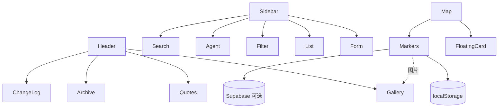

# 架构总览

## 产品定位

**历史人物纪念地图** = 地图 + 影像馆 + 语录 + 档案 +（可选）智能问，在同一时空维度串联人物生平与文献。

## 分层架构（2026 实例）

```
┌──────────────────────────────────────────────────┐
│  UI     Header · Sidebar · Map · Modal Panels    │
├──────────────────────────────────────────────────┤
│  Hooks  useMarkers · useGallery · useSearch · …  │
├──────────────────────────────────────────────────┤
│  Cloud  cloudData · submissions · Auth（可选）     │
├──────────────────────────────────────────────────┤
│  API    /api/chat · /api/amap · agent-health     │
├──────────────────────────────────────────────────┤
│  Store  localStorage 和/或  Supabase              │
├──────────────────────────────────────────────────┤
│  Data   constants · quotes · archives · 行程分包  │
└──────────────────────────────────────────────────┘
```

## Core-only 最小栈

Fork 若 **不上云**，只需 UI + Hooks + localStorage + Built-in Data。  
`isCloudEnabled()` 为 false 时，访客数据仅存本机；内置样本仍通过 `DATA_VERSION` merge。

## Cloud 扩展栈

- **Auth**：Supabase 魔法链接；RLS 区分访客 / editor / admin  
- **Admin**：`/admin` 地点 CRUD、导入、协作者、外接服务检测  
- **Submissions**：登录用户提交待审 → `/admin/review`  
- **Storage**：图片 Base64 → Supabase Storage URL  
- **圣地巡礼**：地点留言 + 可选发图同步影像馆  

## Agent 扩展栈

- 侧栏 **搜索 / 智能问** 切换  
- `api/chat.js`：catalog 检索 + DeepSeek 归纳  
- 内置标点 server 端静态合并（避免 serverless dynamic import 超时）  

## 设计原则

| 原则 | 说明 |
|------|------|
| 可 fork | branding + data 替换即可复用 |
| 渐进增强 | Core 可独立运行；Cloud / Agent 按需开启 |
| 向后兼容 | DATA_VERSION、GALLERY_DATA_VERSION |
| 庄重调性 | 无社交 Wiki、无娱乐化 |

## 信息架构（简图）


